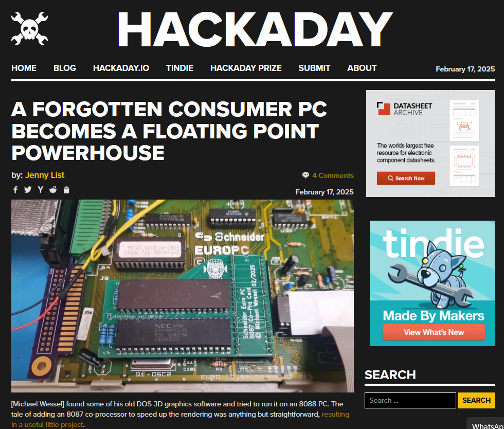

# An 8087 Co-Pro Extension Board for the Schneider Euro PC  

## Latest News

### November 2025

A user reported that he had to add extra bodge wires to VCC and GND
as well as decoupling caps to make the card run more stable at 9.54
MHz.

I have hence rerouted the card - it now has proper decoupling caps,
and the power rails are much thicker.

Here are the [updated Gerbers.](./gerbers-v3.1.zip)

Honestly, none of this is really necessary. I have added two videos
demonstrating that the first revision works fine, in two different
EuroPCs in "good enough" condition.  Both are equipped with a **NEC
V20** and the 8087 CoPro card, running at **9.54 MHz:**

[Demo Video 1](https://youtu.be/3LQWV4543XM)

[Demo Video 2](https://youtu.be/0I_g4UcEDEU)

### February 2025 

Thanks to Hackaday (Jenny List from Hackaday) for [featuring my
project on the frontpage!](https://hackaday.com/2025/02/17/a-forgotten-consumer-pc-becomes-a-floating-point-powerhouse/) 

Here is the [Hackaday project page.](https://hackaday.io/project/202419-an-8087-co-processor-extension-board)

## Background & Problem

The Schneider Euro PC isn't equipped with a 8087 coprocessor
socket. The 8087 was only supported in the later version - the Euro PC
II.

The 8087 was a real game changer for floating point operations. In my
own tests of a 3D graphics programs making heavy use of floating point
operations, I measured a speed-up of a factor of 10.

 

You can find my 3d graphics test programs [here.](./exe/)

An 8087 is thus highly desirable for the Euro PC, and is realized with
this project: 

 

 

In my tests, I successfully used a NEC V20 and the 8087-2 at 9.54 MHz
in my Euro PC without issues.

 

## Solution & Board 

I analyzed the differences between the Euro PC and Euro PC II, and
determined that it should be straight-forward to add an 8087.

### Euro PC CPU Section and FE2010A Controller

### Euro PC II CPU Section and FE2010A Controller

### Analysis & Board Schematics 

As we can see, both machines use the same Faraday FE2010A IBM XT
chipset. All signals are available directly from the CPU socket in
both machines, with one difference - the NPINT FE2010 output is
connected to the 8087 NPINT pin in the Euro PC II, whereas it is
connected to GND in the Euro PC (over a PCB solder jumper). I hence
added an NPINT pin header to the extension board to give users the
option to manually route an NPINT cable from the extension board to
the FE2010A pin if required:

 

However, in my setup and experiments, I actually left the NPINT 8087
pin unconnected, and didn't change the FE2010A NPINT configuration
either, as everything was working fine without it. Even the
`MCPDiag.exe` 8087 diagnosis program found no issues with this
configuration. But you have the choice of routing your own cable if
you choose to do so.

## Gerbers

The Gerbers are [here.](./gerbers-v2.zip)

Enjoy!

## Please leave a "Star" if you like and/or built this project!
